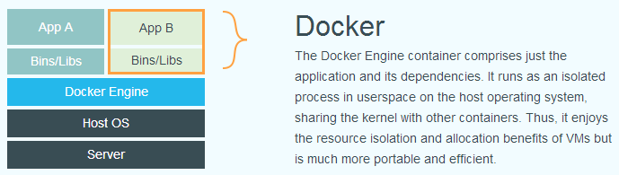

Docker
================
Wei-Ming, Jiang.
May 5, 2023

- <a href="#docker的目標" id="toc-docker的目標">Docker的目標</a>
- <a href="#什麼是虛擬化" id="toc-什麼是虛擬化">什麼是虛擬化</a>
- <a href="#傳統虛擬機器vs容器"
  id="toc-傳統虛擬機器vs容器">傳統虛擬機器vs.容器</a>
- <a href="#docker三元素" id="toc-docker三元素">Docker三元素</a>
  - <a href="#映像檔image" id="toc-映像檔image">映像檔(Image)</a>
  - <a href="#容器container" id="toc-容器container">容器(Container)</a>
  - <a href="#倉庫repository" id="toc-倉庫repository">倉庫(Repository)</a>
- <a href="#參考資料" id="toc-參考資料">參考資料</a>

## Docker的目標

Docker 想要改善**傳統虛擬機器因為需要額外安裝作業系統(Guest
OS)，導致啟動較慢、佔較大記憶體的問題**。

## 什麼是虛擬化

因為每台電腦的作業系統與硬體設備不盡相同，可能會出現「**我的程式可以在我的電腦上正常運作，但搬到你的電腦上就無法執行了**」問題。虛擬化的目的就是模擬出一個環境，讓程式在不同硬體上執行時，都以為自己在同一個環境中執行。

虛擬化的目標是**將一個應用程式所需要的執行環境打包起來，建立一個獨立環境，方便在不同硬體中移動**。

## 傳統虛擬機器vs.容器

傳統的虛擬機器是在你的作業系統上(Host OS)安裝另一個作業系統(Guest
OS)，只要確保我的程式可以在Guest
OS正常運作，我的程式就可以在你的電腦上正常運作。

容器直接將一個應用程式所需的程式碼、函式庫打包，並分配Host
OS上的系統資源。透過容器，應用程式不需要另外安裝作業系統(Guest
OS)也可以執行。

## Docker三元素

### 映像檔(Image)

映像檔可以用來建立Docker容器。

使用者可以下載已經做好的映像檔來直接使用。

### 容器(Container)

容器是從映像檔建立的執行實例，它可以被啟動、開始、停止、刪除。每個容器都是相互隔離的、保證安全的平台。

可以把容器視為一個執行的應用程式與執行程式的簡易版Linux環境(包括root使用者權限、程式空間、使用者空間和網路空間等)。

### 倉庫(Repository)

倉庫是集中存放映像檔的場所，每個倉庫中包含多個映像檔，每個映像檔有不同的標籤。

倉庫分為公開倉庫（Public）和私有倉庫（Private）。最大的公開倉庫是
[Docker
Hub](https://hub.docker.com)，存放了數量龐大的映像檔供使用者下載。

Docker
Hub的概念和Github類似，使用者建立映像檔後可以使用`push`命令將它上傳到倉庫，下次在另一台機器上使用這個映像檔時，只需要從倉庫上`pull`下來就可以了。

## 參考資料

1.  <https://philipzheng.gitbook.io/docker_practice/>

2.  <https://cwhu.medium.com/docker-tutorial-101-c3808b899ac6>
